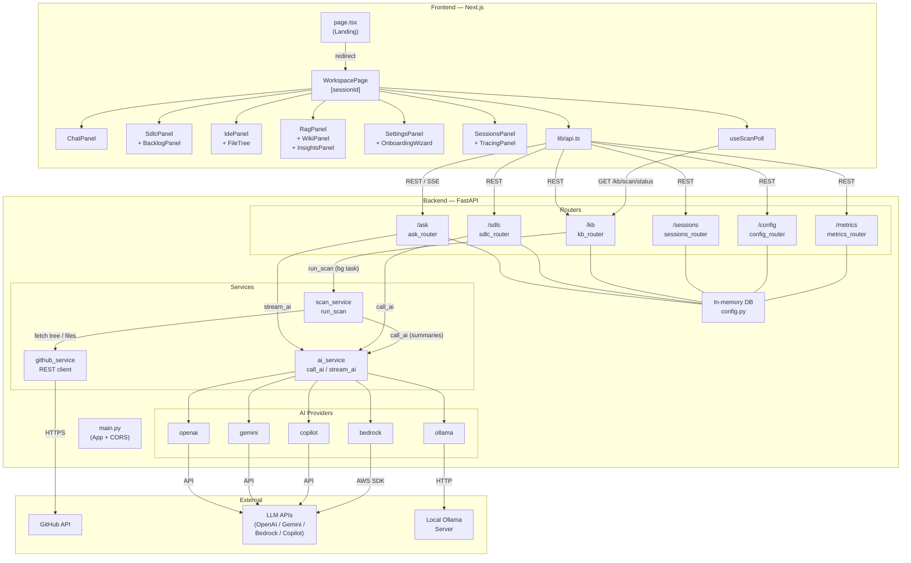

# YUMMY — Architecture Documentation

> Generated from the GitNexus knowledge graph (830 symbols, 1622 relationships, 60 execution flows).
> Index date: 2026-04-21

---

## Overview

**YUMMY** (Your Universal Multi-agent Model Yummy) is an AI-powered, multi-agent SDLC platform. It lets users connect a GitHub repository, build a knowledge base from it, and then interact with it via:

- **RAG Chat** — ask natural-language questions answered from the codebase context
- **SDLC Workflow** — a sequential multi-agent pipeline (BA → SA → Dev Lead → DEV/QA/SEC/SRE) that produces complete engineering artefacts for a Change Request
- **IDE Simulator** — browse and view repo files with AI-aware context

The system is a full-stack monorepo split into two applications:

| App | Tech | Root |
|-----|------|------|
| Backend API | Python 3.11 · FastAPI · Uvicorn | `backend/` |
| Frontend SPA | Next.js 14 · React 18 · TypeScript · Tailwind | `frontend/` |

**Stats:** 60 files · 830 symbols · 1622 relationships · 38 functional clusters · 60 execution flows

---

## Repository Structure

```
yummy-monorepo/
├── backend/
│   ├── main.py                   # FastAPI app, router registration, CORS
│   ├── config.py                 # In-memory DB and API_CONFIG store
│   ├── dependencies.py           # Session factory & guard helpers
│   ├── models.py                 # Pydantic request/response models
│   ├── routers/
│   │   ├── ask_router.py         # /ask  — RAG Q&A (streaming SSE + sync)
│   │   ├── sdlc_router.py        # /sdlc — Multi-agent SDLC workflow
│   │   ├── kb_router.py          # /kb   — Knowledge base & repository scan
│   │   ├── sessions_router.py    # /sessions — Session CRUD
│   │   ├── config_router.py      # /config  — Provider/API-key configuration
│   │   ├── metrics_router.py     # /metrics — Usage & cost tracking
│   │   └── utils_router.py       # /  /health — Utility endpoints
│   └── services/
│       ├── ai_service.py         # call_ai() and stream_ai() orchestrators
│       ├── scan_service.py       # GitHub repo scan → knowledge base builder
│       ├── github_service.py     # GitHub REST API client
│       └── providers/
│           ├── openai.py         # OpenAI (gpt-4o, o3, …)
│           ├── gemini.py         # Google Gemini
│           ├── copilot.py        # GitHub Copilot (via token)
│           ├── bedrock.py        # AWS Bedrock (Claude, Titan, Llama3, …)
│           └── ollama.py         # Ollama local inference
├── frontend/
│   ├── app/
│   │   ├── page.tsx              # Landing page — auto-creates/redirects to session
│   │   └── workspace/[sessionId]/
│   │       └── page.tsx          # Main workspace orchestrator
│   ├── components/workspace/
│   │   ├── ChatPanel.tsx         # Primary chat + command input
│   │   ├── IdePanel.tsx          # IDE file viewer
│   │   ├── SdlcPanel.tsx         # SDLC workflow approval UI
│   │   ├── BacklogPanel.tsx      # JIRA-style backlog viewer
│   │   ├── WikiPanel.tsx         # Auto-generated repo wiki
│   │   ├── InsightsPanel.tsx     # Code insights from knowledge base
│   │   ├── RagPanel.tsx          # Streaming RAG response panel
│   │   ├── NodeGraph.tsx         # Visual dependency graph
│   │   ├── SessionsPanel.tsx     # Session list & management
│   │   ├── TracingPanel.tsx      # AI request cost/latency tracing
│   │   ├── SettingsPanel.tsx     # Provider & API key settings
│   │   ├── OnboardingWizard.tsx  # First-run setup wizard
│   │   ├── AgentCard.tsx         # SDLC agent output card
│   │   ├── FileTree.tsx          # Repo file browser
│   │   └── DbPanel.tsx           # In-memory DB inspector
│   ├── hooks/
│   │   └── useScanPoll.ts        # Scan progress polling hook
│   └── lib/
│       ├── api.ts                # Full typed API client
│       ├── types.ts              # Shared TypeScript interfaces
│       ├── theme.ts              # Theme engine (THEMES map)
│       └── mdToHtml.ts           # Markdown → HTML renderer
├── start.sh / start.bat          # One-command dev launcher
└── ARCHITECTURE.md               # This file
```

---

## Functional Areas (Clusters)

The knowledge graph detected **38 communities** grouped into six high-level areas:

| Area | Cohesion | Key Symbols |
|------|----------|-------------|
| **Services** | 0.96 | `ai_service`, `scan_service`, `github_service` |
| **[sessionId] Workspace** | 0.86–0.89 | `WorkspacePage`, `handleCmd`, `sendAsk` |
| **Routers** | 0.63–1.0 | `ask_router`, `sdlc_router`, `kb_router`, `sessions_router` |
| **Workspace Components** | 1.0 | `ChatPanel`, `IdePanel`, `SdlcPanel`, `WikiPanel`, … |
| **Providers** | 0.62–0.80 | `stream_openai`, `stream_gemini`, `stream_copilot`, `stream_bedrock`, `stream_ollama` |
| **Backend Core** | 1.0 | `main`, `config`, `dependencies`, `models` |

---

## Key Execution Flows

### 1. RAG Streaming Chat (`POST /ask`)

User types a question in `ChatPanel`. The message is submitted to the backend over SSE.

```
ChatPanel.submitCmd
  └─► WorkspacePage.sendAsk
        └─► api.askStream  (SSE EventSource)
              └─► POST /ask  →  ask_router.ask_question_sync
                    ├─► _build_rag_prompt  (retrieves top-2 KB insight chunks)
                    └─► event_stream  (async generator)
                          └─► stream_ai
                                ├─► stream_openai    (if provider = openai)
                                ├─► stream_gemini    (if provider = gemini)
                                ├─► stream_copilot   (if provider = copilot)
                                ├─► stream_bedrock   (if provider = bedrock)
                                └─► stream_ollama    (if provider = ollama)
```

Key files: `backend/routers/ask_router.py:64`, `backend/services/ai_service.py:162`, `frontend/app/workspace/[sessionId]/page.tsx:sendAsk`

---

### 2. Free-form Chat (`POST /ask/free`)

Same SSE pipeline but **no KB context** — used by the `/btw` slash command for general questions.

```
ChatPanel  →  /ask/free  →  ask_free_stream  →  stream_ai  →  provider
```

---

### 3. SDLC Multi-Agent Workflow (`/sdlc/*`)

A **sequential human-in-the-loop pipeline** where each AI agent produces a document that the user can edit before approving to advance to the next stage.

```
User: /sdlc <Change Request>
  │
  ▼
POST /sdlc/start                    ← sdlc_start
  └─► BA Agent  (writes BRD)        ← call_ai("BA", …)
        state: waiting_ba_approval

User reviews BRD in SdlcPanel, edits, clicks Approve
  │
  ▼
POST /sdlc/approve-ba               ← sdlc_approve_ba
  ├─► SA Agent  (writes Architecture Doc)   ← call_ai("SA", …)
  └─► PM Agent  (generates JIRA backlog JSON) ← call_ai("PM", …)
        state: waiting_sa_approval

User reviews SA doc + backlog, clicks Approve
  │
  ▼
POST /sdlc/approve-sa               ← sdlc_approve_sa
  └─► Dev Lead Agent (writes Implementation Plan) ← call_ai("DEV_LEAD", …)
        state: waiting_dev_lead_approval

User reviews Dev Lead plan, clicks Approve
  │
  ▼
POST /sdlc/approve-dev-lead         ← sdlc_approve_dev_lead
  ├─► DEV Agent      (pseudocode + file list)
  ├─► QA Agent       (test plan + test cases)
  ├─► SECURITY Agent (STRIDE threat model + OWASP checklist)
  └─► SRE Agent      (deployment runbook + rollback plan)
        state: done
```

Workflow states: `idle → running_ba → waiting_ba_approval → running_sa → waiting_sa_approval → running_dev_lead → waiting_dev_lead_approval → running_rest → done`

Key files: `backend/routers/sdlc_router.py`, `frontend/components/workspace/SdlcPanel.tsx`, `frontend/components/workspace/BacklogPanel.tsx`

---

### 4. Repository Scan & Knowledge Base Build (`POST /kb/scan`)

```
OnboardingWizard / ChatPanel: /scan <github-url>
  └─► POST /kb/scan  →  kb_router.start_scan  (spawns background task)
        └─► scan_service.run_scan
              ├─► github_service.get_repo_info    (repo metadata)
              ├─► github_service.get_repo_tree    (file tree)
              ├─► github_service.github_raw       (file contents, batched)
              └─► ai_service.call_ai              (summarise batches → insights)
                    └─► [active provider]

Polling: frontend/hooks/useScanPoll.ts
  └─► GET /kb/scan/status  (every 2 s while running=true)
        └─► on complete: fetchKb() + redirect to wiki tab
```

Key files: `backend/services/scan_service.py:12`, `backend/services/github_service.py`, `frontend/hooks/useScanPoll.ts`

---

### 5. Session Bootstrap & Workspace Initialisation

```
browser → /  →  page.tsx:Home
  └─► api.sessions.list()
        ├─► sessions found → router.push(/workspace/{id})
        └─► none found → api.sessions.create() → router.push(/workspace/{id})

/workspace/[sessionId]  →  WorkspacePage
  ├─► fetchSession()   (GET /sessions/{id})
  ├─► fetchStatus()    (GET /config/status)
  ├─► fetchKb()        (GET /kb)
  ├─► fetchSessions()  (GET /sessions)
  └─► setInterval(4 s) { fetchSession, fetchStatus }
```

Key files: `frontend/app/page.tsx`, `frontend/app/workspace/[sessionId]/page.tsx:37`

---

## AI Provider Abstraction

`ai_service.py` provides two entry points that dispatch to the active provider:

| Function | Usage | Returns |
|----------|-------|---------|
| `call_ai(agent, prompt, instruction)` | SDLC agents, scan summaries | `str` (full response) |
| `stream_ai(prompt, instruction)` | RAG chat, free chat | `AsyncGenerator[str, None]` |

Provider selection is runtime-configurable via `POST /config/provider`. Each provider module exposes `stream_<name>()` and `call_<name>()` with a consistent interface.

| Provider | Auth | Notes |
|----------|------|-------|
| `openai` | `OPENAI_API_KEY` | gpt-4o, o3, … |
| `gemini` | `GEMINI_API_KEY` | gemini-1.5-pro, flash, … |
| `copilot` | `COPILOT_GITHUB_TOKEN` | gpt-4o, claude-sonnet-4-5, o3-mini |
| `bedrock` | AWS credentials | Claude 3.5, Titan, Llama3, … |
| `ollama` | local URL | llama3, codellama, mistral, … |

---

## Data Model

All state is held **in-memory** (no database). The `DB` dict in `config.py` acts as the application store:

```python
DB = {
    "sessions": {
        "<session_id>": {
            "id": str,
            "name": str,
            "created_at": str,
            "workflow_state": str,       # idle | running_* | waiting_* | done
            "chat_history": [{"role": str, "text": str}],
            "agent_outputs": {
                "requirement": str,
                "ba": str,
                "sa": str,
                "dev_lead": str,
                "dev": str, "qa": str, "security": str, "sre": str,
            },
            "jira_backlog": [{"title": str, "tasks": [...]}],
        }
    },
    "knowledge_base": {
        "project_summary": str,
        "insights": [{"files": [...], "summary": str}],
        "file_tree": [...],
        "repo_info": {"repo": str, "url": str},
    },
    "scan_status": {"running": bool, "text": str, "progress": int},
    "metrics": {"total_requests": int, "total_cost_usd": float, "logs": [...]},
}
```

> **Note:** All data is lost on backend restart. For production use, this store should be replaced with a persistent database.

---

## API Surface

| Prefix | Router | Purpose |
|--------|--------|---------|
| `/` | `utils_router` | Health, info |
| `/sessions` | `sessions_router` | Session CRUD |
| `/ask` | `ask_router` | RAG streaming + sync chat |
| `/sdlc` | `sdlc_router` | Multi-agent SDLC workflow |
| `/kb` | `kb_router` | Knowledge base, repo scan |
| `/config` | `config_router` | AI provider & API key config |
| `/metrics` | `metrics_router` | Usage & cost telemetry |

---

## Architecture Diagram



---

## Cross-cutting Concerns

### Authentication
No user authentication is implemented. The backend is intended to run locally (`localhost:8000`). API keys for LLM providers are stored in `API_CONFIG` (in-memory) and can be set via the Settings panel or environment variables.

### Streaming
The `/ask` and `/ask/free` endpoints return `StreamingResponse` with `media_type="text/event-stream"` (SSE). The frontend consumes this with a custom `api.askStream()` async iterator in `frontend/lib/api.ts`.

### Session Isolation
Each browser session gets a UUID `session_id`. All state (chat history, SDLC workflow, agent outputs) is scoped to that ID in the in-memory `DB`. Sessions survive page refreshes but are lost on backend restart.

### Cost Tracking
`ai_service.py` tracks token usage and estimated USD cost per request. Logs are surfaced in the `TracingPanel` via `GET /metrics`.

### Theming
`frontend/lib/theme.ts` defines multiple terminal-style colour themes. The active theme is persisted in `localStorage` and applied on mount via `applyTheme()` / `loadSavedTheme()`.

---

*Generated by GitNexus · yummy-monorepo · 830 symbols · 1622 relationships*
