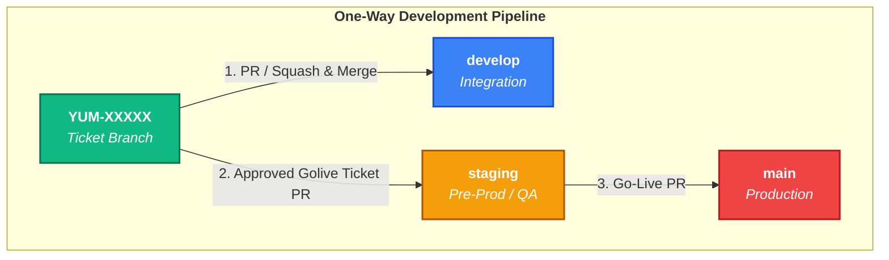

```markdown
# Git Workflow Standard

This document establishes the official Git workflow for our development team. Adhering to these guidelines ensures a clean commit history, seamless deployment pipelines, and full traceability between our codebase and **Jira** tickets.

## 1. Branching Strategy Overview

Our repository maintains three permanent environment branches alongside temporary ticket branches. **The flow of code is strictly one-way (Upward / Forward).**



```text
 [main]       ▲  (Go-Live Production Release)
              │
              │  PR / Merge
              │
 [staging]    ▲  (Pre-Prod / QA Regression Testing)
              │
              │  PR / Merge
              │
 [develop]    ▲  (Central Integration Branch)
              │
              ▲  PR / Squash & Merge
              │
 [YUM-XXXXX] ─┘  (Your Short-Lived Feature/Bugfix Branch)
```

### Permanent Branches

* **`main`**: Reflects the current production-ready code. **Direct commits are strictly prohibited.**
* **`staging`**: Used for Pre-Production / QA testing and Release Candidates (RC).
* **`develop`**: The integration branch for feature development. All daily work converges here.

---

## 2. The Step-by-Step Development Lifecycle

### Step 1: Pick up a Jira Ticket

Before writing any code, ensure the Jira ticket is assigned to you and moved to **In Progress** in Jira.

### Step 2: Create a Ticket Branch

Always branch off the latest `main` branch. Do not pull from `staging` or `develop` when starting ticket work. Your branch name **must** be the precise Jira ticket key only.

* **Format:** `JIRA-TICKET-ID`
* **Prefix:** Not allowed.
* **Examples:**
* `YUM-00001`
* `YUM-00042`


```bash
# Update your local main branch
git checkout main
git pull origin main

# Create and switch to your ticket branch
git checkout -b YUM-00001

```

### Step 3: Local Development & Commits

Write your code and commit locally. Keep your commit messages clear, concise, and ideally prefixed with the ticket ID.

* **Example:** `git commit -m "YUM-00001: implement JWT validation middleware"`

### Step 4: Pull Requests to `develop` (The One-Way Flow)

Once your work is complete and local tests pass, push your branch to the remote repository and open a **Pull Request (PR)** targeting `develop`.

```bash
git push origin YUM-00001

```

* **Rule:** Code moves **one-way**: `YUM-XXXXX` $\rightarrow$ `develop`.
* **PR Requirements:**
* Link the Jira ticket in the PR description.
* Pass all automated CI checks (linting, tests, build).
* Get at least **1 peer review approval** before merging.
* Use **Squash and Merge** to keep the `develop` history clean.
* If the merge into `develop` has conflicts, resolve them in the `develop` merge flow and run a build to verify the code still works normally before completing the merge.


* **Post-Merge:** Delete your remote and local ticket branches.

---

## 3. Release & Go-Live Process

Releases are managed collectively by merging up through the environment hierarchy.

### Phase 1: Staging & QA Testing

When a golive period is triggered, all Jira tickets approved for that golive period must move from their ticket branches to `staging` for final validation.

1. Create a Pull Request from each approved ticket branch into `staging`.
2. Once merged, the Staging environment automatically deploys.
3. **QA Testing:** The QA team tests the approved tickets on Staging.
* *Note:* If bugs are found, fixes should be made on the same ticket branch, then re-approved and merged into `staging` for the same golive period.


### Phase 2: Go-Live (Production)

If everything is verified and marked "OK" on Staging, it is time to deploy to production.

1. Open a Pull Request from `staging` into `main`.
2. Upon approval and merge, the production pipeline triggers.
3. **Tagging:** Create a release tag on `main` for version tracking (e.g., `v1.2.0`).

---

## 4. Summary Rulebook

> 🚨 **The Golden Rules**
> * **Never** commit directly to `develop`, `staging`, or `main`.
> * **Never** merge `staging` backward into a ticket branch.
> * Keep your ticket branch updated by pulling the latest changes *from* `main` (`git pull origin main`).
> * No Jira Ticket = No Branch. Every single line of code must be traceable to a requirement.
> 
> 

```

```